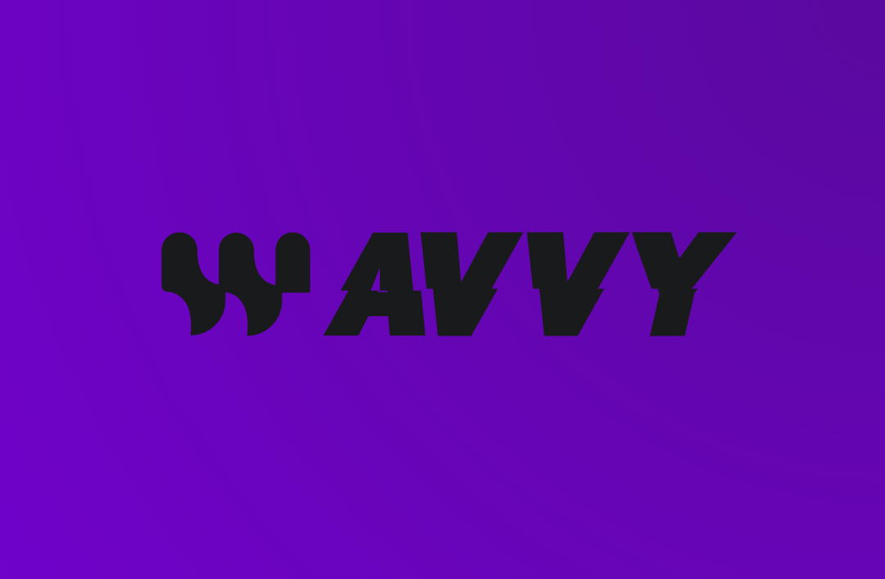

# Vývoj Hudobnej Streamovacej Aplikácie v Android Studiu
Bakalárska Práca - Vývoj hudobnej streamovacej aplikácie pre Android a porovnanie jej funkcionality s existujúcimi platformami

*Cieľ práce*

Cieľom tejto bakalárskej práce je navrhnúť a implementovať hudobnú streamovaciu aplikáciu pre Android pomocou jazyka Java v prostredí Android Studio.
Aplikácia bude slúžiť na prehrávanie vlastnej hudby vytvorenej autorom. 
Po úspešnom vývoji aplikácie bude jej funkcionalita porovnaná s existujúcimi komerčnými riešeniami, ako sú Spotify, Apple Music a iné. 
Porovnanie bude zamerané na kľúčové aspekty, ako je prehrávanie hudby, používateľské rozhranie, výkon, správa knižnice a ďalšie funkcie. 
Práca taktiež poskytne stručný prehľad o procese tvorby hudby a nástrojoch, ktoré autor využíva.

*Charakter práce*

Práca sa zameriava na vývoj softvéru, konkrétne na tvorbu hudobnej streamovacej aplikácie pre Android platformu. V teoretickej časti bude analyzovaný trh hudobných streamovacích služieb a ich funkcionalita. 
Praktická časť bude venovaná návrhu a implementácii aplikácie, ktorá bude obsahovať základné funkcie ako prehrávanie skladieb, správa playlistov, vyhľadávanie a zobrazenie informácií o skladbách. 
Po vytvorení aplikácie bude vykonaná porovnávacia analýza s existujúcimi hudobnými platformami z hľadiska funkcií, používateľského rozhrania a technických možností.

*Najdôležitejšie kompetencie získané spracovaním témy*

Vývoj mobilných aplikácií pre Android pomocou Android Studio (Java),
Návrh a implementácia hudobného prehrávača a správy knižnice skladieb,
Porovnanie funkcionality vlastnej aplikácie s komerčnými hudobnými službami,
Analýza a optimalizácia používateľského rozhrania a zážitku,
Prezentácia vlastnej hudby prostredníctvom vytvorenej aplikácie.

*Očakávané výstupy*

Funkčná mobilná aplikácia pre Android na prehrávanie vlastnej hudby,
Implementácia základných funkcionalít streamovacej platformy vrátane správy knižnice, prehrávania a navigácie,
Porovnávacia analýza aplikácie s existujúcimi službami ako Spotify a Apple Music,
Technická dokumentácia popisujúca návrh a implementáciu aplikácie,
Krátky prehľad procesu tvorby hudby a nástroje, ktoré autor používa.

*Názov Aplikácie*

Wavvy

*Wavvy Logo*

  

